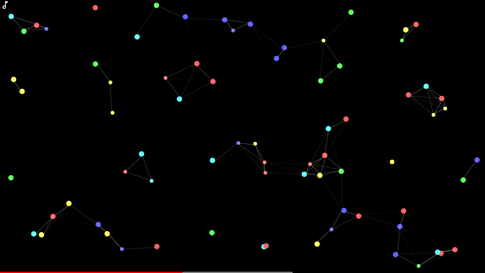

# Connecting Dots

Connecting, audio responsive dots made using p5.js with YouTube-like player and controls 

## Inspiration

Inspired by Wallpaper Engine [custom wallpaper](https://steamcommunity.com/sharedfiles/filedetails/?id=819343682)

## Controls 

Key | Function
:---: | ---
Spacebar, k | Pause/Play/Play again
Up, Down arrows | Increase/Decrease volume 5%
Left, Right arrows | Seek backward/forward 5 seconds
j, l | Seek backward/forward 10 seconds
m | Mute/unmute audio
f | Full screen
d | FPS counter
c | Enable/Disable hand placing dots
r | Remove all hand placed dots
Delete | Remove chosen (manually placed) dot

## Issues

**Loading new audio files produces a [memory leak](https://github.com/processing/p5.js-sound/issues/88)**
